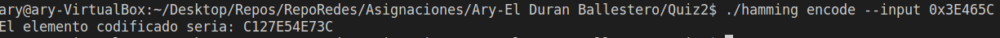
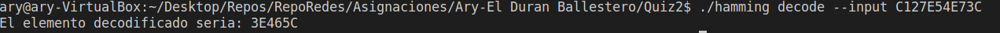
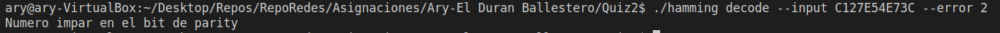

**Instituto Tecnológico de Costa Rica  
Escuela de Computación  
Redes GR 2
Prueba Corta #2 y #3  
Profesor Gerardo Nereo Campos Araya  
Estudiante Ary-El Durán Ballestero  
Fecha de Entrega 9/9/2022**

# Manual de Usuario

## Encoder

Para poder utilizar el encoder, se tienen que pasar los siguientes parámetros por línea de comando.

- --encode: Para decirle al programa que se quiere encodear algo.
- Número hexadecimal: Este número es el que se le va a aplicar el Hamming

## Decoder

Para poder utilizar el decoder, se tienen que pasar los siguientes parámetros por línea de comando.

- --decode: Para decirle al programa que se quuiere decodear algo.
- Número hexadecimal: Este número es el que se le va a decoder.
- error: Este es opcional, va a recibir varios números despues de este parámetro que van a realizarle un toggle a los bits que se encuentren en la posición marcada por los números añadidos por la linea de comandos.

# Pruebas Unitarias

# Referencias bibliográficas

Bendersky E. (17 de julio del 2010). How do I get the lower 8 bits of an int?. Stack Overflow. https://stackoverflow.com/questions/3270307/how-do-i-get-the-lower-8-bits-of-an-int

Forefinger, Box Box (9 de enero del 2016). How do I get bit-by-bit data from an integer value in C?. Stack Overflow. https://stackoverflow.com/questions/2249731/how-do-i-get-bit-by-bit-data-from-an-integer-value-in-c

Weather Vane (9 de abril del 2015). How to convert string to hex value in C. Stack Overflox. https://stackoverflow.com/questions/29547115/how-to-convert-string-to-hex-value-in-c
