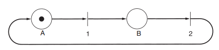

# Tecnológico de Costa Rica
## Ingenieria en Computación
### IC-7620 - Redes
### Isaac David Ortega Arguedas
### Carnet: 2018189196
### II Semestre 2022
---
# Resumen 4 y Resumen 5
## Verificación de protocolos
Los protocolos empleados en la practica, así como los programas que los implementan, suelen ser complicados. Por esto, se requiere mucha investigación para encontrar técnicas matemáticas formales con las que especificar y verificar los protocolos. A continuación se presentan algunos modelos y técnicas.
### Modelos de máquinas de estado finito
Un concepto clave empleado en muchos modelos de protocolos es el de la máquina de estados finitos. Con esta técnica, cada máquina de protocolo siempre está en un estado específico en cualquier instante.

En la mayoría de los casos puede agruparse un gran número de estados a fin de analizarlos. Por lo general, los estados se escogen para que sean aquellos instantes en que la máquina de protocolo está esperando que ocurra el siguiente evento. En este punto, el estado de la máquina de protocolo está determinado por completo por los estados de sus variables.

Vale la pena decir algo sobre el estado del canal. El concepto de una trama que está “en el canal” es, por supuesto, una abstracción. Lo que queremos decir en realidad es que es posible que una trama se haya recibido, pero no procesado, en el destino. Una trama permanece “en el canal” hasta que la máquina de protocolo ejecuta FromPhysicalLayer y la procesa.

De cada estado hay cero o más transiciones posibles a otros estados. Las transiciones ocurren cuando sucede algún evento.

Un estado en particular se designa como estado inicial. Este estado corresponde a la descripción del sistema cuando comienza a funcionar, o en algún punto conveniente poco después. Desde el estado inicial pueden alcanzarse algunos, o quizá todos, los demás estados mediante una secuencia de transiciones.

Enumerando cuidadosamente cada sucesor posible para cada estado, podemos construir el grafo de asequibilidad y analizar el protocolo. Puede servir para detectar una variedad de errores en la especificación del protocolo. 
### Modelos de red de Petri
Una red de Petri tiene cuatro elementos básicos: lugares, transiciones, arcos y tokens. Un lugar representa un estado en el que puede estar parte del sistema. En la imagen siguiente se muestra una red de Petri con dos lugares, A y B, que aparecen como círculos. El sistema actualmente está
en el estado A, indicado por el token (punto grueso) en el lugar A. Se utiliza una barra horizontal o vertical para indicar una transición. Cada transición tiene cero o más arcos de entrada, que llegan de sus lugares de entrada, y cero o más arcos de salida, que van a sus lugares de salida.

Se habilita una transición si hay cuando menos un token de entrada en cada uno de sus lugares de entrada. Cualquier transición habilitada puede dispararse a voluntad, quitando un token de cada lugar de entrada y depositando un token en cada lugar de salida. Si el número de arcos de entrada no es igual al número de arcos de salida, no se conservarán los tokens. Si se habilitan dos o
más transiciones, cualquiera de ellas puede dispararse.

Las redes de Petri son utiles para modelar prototipos. Se omiten los detalles innecesarios.
Aquí no hay estados compuestos; el estado del emisor, el estado del canal y el estado del receptor se representan por separado.
Las redes de Petri pueden servir para detectar fallas de protocolo de una manera parecida a como se hace con máquinas de estados finitos.
Las redes de Petri pueden representarse convenientemente en una forma algebraica semejante
a una gramática. Cada transición contribuye con una regla a la gramática. Cada regla especifica lugares de entrada y salida de la transición.
## Bluetooth
En 1994, la empresa L. M. Ericsson se interesó en conectar sus teléfonos móviles y otros dispositivos sin necesidad de cables. En conjunto con otras cuatro empresas, formó un SIG con el propósito de desarrollar un estándar inalámbrico para interconectar computadoras, dispositivos de comunicaciones y accesorios a través de radios inalámbricos de bajo consumo de energía, corto alcance y económicos.

 La idea original eran tan sólo prescindir de cables entre dispositivos, su alcance se expandió rápidamente al área de las LANs inalámbricas. Esta expansión le dio más utilidad al estándar, pero también provocó el surgimiento de competencia con el 802.11. Lo peor es que los dos sistemas interfieren entre sí en el ámbito eléctrico.
### Arquitectura de Bluetooth
La unidad básica de un sistema Bluetooth es una piconet, que consta de un nodo maestro y hasta siete nodos esclavos activos a una distancia de 10 metros. En una sala grande.  pueden encontrarse varias piconets y que pueden conectarse mediante un nodo puente. Un conjunto de piconets interconectadas se denomina scatternet.

La razón para el diseño maestro/esclavo es que los diseñadores pretendían facilitar la implementación de chips Bluetooth completos por debajo de 5 dólares. La consecuencia de esta decisión es que los esclavos son sumamente pasivos y realizan todo lo que los maestros les indican.
### Aplicaciones de Bluetooth
La especificación Bluetooth V1.1 designa el soporte de 13 aplicaciones, denominadas perfil, en particular y proporciona diferentes pilas de protocolos para cada una. 

Un perfil de acceso genérico no es realmente una aplicación, sino más bien la base sobre la
cual se construyen las aplicaciones; su tarea principal es ofrecer una manera para establecer y mantener enlaces (canales) seguros entre el maestro y los esclavos. El perfil de descubrimiento de servicios es utilizado por los dispositivos para descubrir qué servicios ofrecen otros dispositivos. Se espera que todos los dispositivos Bluetooth implementen estos dos perfiles. Los restantes son opcionales.

El perfil de puerto serie es un protocolo de transporte que la mayoría de los perfiles restantes utiliza.El de intercambio genérico define una relación cliente-servidor para el traslado de datos. Al igual que el perfil de puerto serie, es la base para otros perfiles.

El perfil de acceso a LAN permite a un dispositivo Bluetooth conectarse a una red fija, el de acceso telefónico a redes permite a una computadora portátil conectarse a un teléfono móvil que contenga un módem
integrado, sin necesidad de cables y el de fax es parecido al de acceso telefónico a redes, excepto que posibilita a máquinas de fax inalámbricas enviar y recibir faxes a través de teléfonos móviles sin que exista una conexión por cable entre ambos. Como se puede apreciar estos tres perfiles estan destinado a la conectividad.
Para telefonia se tienen 3 perfiles, siendo estos; el perfil de telefonía inalámbrica que proporciona una manera de conectar el handset (teléfono) de un teléfono inalámbrico a una estación base. El perfil intercom hace posible que dos teléfonos se conecten como walkie-talkies. Por último, con el perfil headset se puede realizar comunicación de voz entre la diadema telefónica y su estación base.
Los ultimos tres perfiles sirven para intercambiar objetos entre dos dispositivos inalámbricos. Siendo estos el perfil de envio de objetos, el de transferencia de archivos y el de sincronización.
###  La pila de protocolos de Bluetooth
El estándar Bluetooth cuenta con muchos protocolos agrupados con poco orden en capas. La capa inferior es la capa de radio física, esta se ocupa de la transmisión y la modulación de radio. La capa de banda base se encarga de la manera en que el maestro controla las ranuras de tiempo y de que éstas se agrupen en tramas.

El administrador de enlaces se encarga de establecer canales lógicos entre dispositivos, incluyendo administración de energía, autenticación y calidad de servicio. El protocolo de adaptación y control de enlaces lógicos aísla a las capas superiores de los detalles de la transmisión.

La siguiente capa hacia arriba es la de middleware, que contiene una mezcla de diferentes protocolos.  Los protocolos RFcomm, de telefonía y de descubrimiento de servicios son nativos. RFcomm (comunicación de Radio Frecuencia) es el protocolo que emula el puerto serie estándar de las PCs para la conexión de teclados, ratones y módems, entre otros dispositivos. Su propósito
es permitir que dispositivos heredados lo utilicen con facilidad. El protocolo de telefonía es de tiempo real y está destinado a los tres perfiles orientados a voz. También se encarga del establecimiento y terminación de llamadas. Por último, el protocolo de descubrimiento de servicios se emplea
para localizar servicios dentro de la red.

En la capa superior es donde se ubican las aplicaciones y los perfiles, que utilizan a los protocolos de las capas inferiores para realizar su trabajo. 
###  La capa de radio de Bluetooth
La capa de radio traslada los bits del maestro al esclavo, o viceversa. Es un sistema de baja potencia con un rango de 10 metros que opera en la banda ISM de 2.4 GHz. La banda se divide en 79 canales de 1 MHz cada uno. Para asignar los canales de manera equitativa, el espectro de saltos de frecuencia se utiliza a 1600 saltos por segundo y un tiempo de permanencia de 625 μseg.
###  La capa de banda base de Bluetooth
es lo más parecido a una subcapa MAC. Esta capa convierte el flujo de bits puros en tramas y define algunos formatos clave. En la forma más sencilla, el maestro de cada piconet define una serie de ranuras de tiempo de 625 μseg y las transmisiones del maestro empiezan en las ranuras pares, y las de los esclavos, en las ranuras impares. Ésta es la tradicional multiplexión por división de tiempo, en la cual el maestro acapara la mitad de las ranuras y los esclavos comparten la otra mitad. Las tramas pueden tener 1, 3 o 5 ranuras de longitud.

Cada trama se transmite por un canal lógico, llamado enlace, entre el maestro y un esclavo.
Hay dos tipos de enlaces. El primero es el ACL (Asíncrono no Orientado a la Conexión), que se utiliza para datos conmutados en paquetes disponibles a intervalos irregulares. Las tramas se
pueden perder y tienen que retransmitirse. Un esclavo puede tener sólo un enlace ACL con su
maestro.

El otro tipo de enlace es el SCO (Síncrono Orientado a la Conexión), para datos en tiempo
real, como ocurre en las conexiones telefónicas. A este tipo de canal se le asigna una ranura fija
en cada dirección. 
###  La capa L2CAP de Bluetooth
Tiene tres funciones principales:
- Acepta paquetes de hasta 64 KB provenientes de las capas superiores y los divide en tramas para transmitirlos. Las tramas se reensamblan nuevamente en paquetes en el otro extremo.
-  Maneja la multiplexión y desmultiplexión de múltiples fuentes de paquetes. Cuando
se reensambla un paquete, la capa L2CAP determina cuál protocolo de las capas superiores lo manejará.
- Se encarga de la calidad de los requerimientos de servicio, tanto al establecer los enlaces como durante la operación normal.
### Estructura de la trama de Bluetooth
Existen diversos formatos de trama, se comentará el más importante. Este empieza con un código de acceso que identifica al maestro, cuyo propósito es que los esclavos que se encuentren en el rango de alcance de dos maestros sepan cuál tráfico es para ellos.
A continuación se encuentra un encabezado de 54 bits que contiene campos comunes de la subcapa MAC. Luego está el campo de datos, de hasta 2744 bits (para una transmisión de cinco ranuras). Para una sola ranura de tiempo, el formato es el mismo excepto que el campo de datos es de 240 bits.

En el encabezado, el campo Dirección identifica a cuál de los ocho dispositivos activos está destinada la trama. El campo Tipo indica el tipo de trama el tipo de corrección de errores que se utiliza en el campo de datos y cuántas ranuras de longitud tiene la trama.

## Bibliografia
Tanenbaum, A. (2003). *Redes de computacion. Cuarta edicion*.