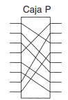
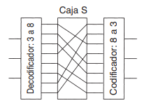
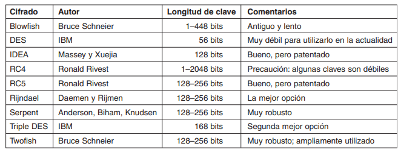

# Tecnológico de Costa Rica
## Ingenieria en Computación
### IC-7620 - Redes
### Isaac David Ortega Arguedas
### Carnet: 2018189196
### II Semestre 2022
---
# Resumen 6 y Resumen 7

## Algoritmos de Clave Simétrica

Utilizan la misma clave para encriptar y desencriptar. Nos enfocaremos en los cifrados en bloques, que toman un bloque de n bits de texto llano como entrada y lo transforman utilizando la clave en un bloque de n bits de texto cifrado.

Los algoritmos criptográficos pueden implementarse ya sea en hardware (para velocidad) o en software (para flexibilidad).

Un dispositivo, conocido como caja P (la P significa permutación), se utiliza para efectuar una transposición de una entrada de 8 bits. Si los 8 bits se designan de arriba hacia abajo como 01234567, la salida de esta caja P en particular es 36071245. Este diseño sigue el principio de Kerckhoff: el atacante sabe que el método general está permutando los bits. Lo que no sabe es qué bit va en qué lugar, y esto es la clave.

La sustitución se lleva a cabo mediante cajas S.

Con el alambrado que se muestra, si los ocho números octales 01234567 entraran uno tras otro, la secuencia de salida sería de 24506713. En otras palabras, se ha reemplazado el 0 por el 2, el 1 por el 4, etcétera. Nuevamente, puede lograrse cualquier sustitución mediante el alambrado adecuado de la caja P dentro de la caja S.

La potencia real de estos elementos básicos sólo se hace aparente cuando ponemos en cascada una serie completa de cajas para formar un cifrado de producto. 

Los cifrados de producto que operan en entradas de k bits para generar salidas de k bits son muy comunes. Por lo general, k es 64 a 256. Una implementación de hardware por lo general tiene por lo menos 18 etapas físicas. Una implementación de software se programa como un ciclo con por lo menos 8 iteraciones, cada una de las cuales realiza sustituciones de tipo caja S en subbloques del bloque de datos de 64 a 256 bits, seguido por una permutación que mezcla las salidas de las cajas S. Con frecuencia hay una permutación inicial especial y también una al final. En la literatura, las iteraciones se conocen como rondas.

### DES—El Estándar de Encriptación de Datos

En enero de 1977, el gobierno de Estado Unidos adoptó un cifrado de producto desarrollado por IBM como su estándar oficial para información no secreta. Este cifrado, el DES (Estándar de Encriptación de Datos), se adoptó ampliamente en la industria para usarse con productos de seguridad. Ya no es seguro en su forma original, pero aún es útil en una forma modificada. Ahora explicaremos el funcionamiento del DES.

El texto llano se encripta en bloques de 64 bits, produciendo 64 bits de texto cifrado. El algoritmo, que se parametriza mediante una clave de 56 bits, tiene 19 etapas diferentes. 

Cada etapa toma dos entradas de 32 bits y produce dos salidas de 32 bits. La salida de la izquierda simplemente es una copia de la entrada de la derecha. La salida de la derecha es el OR exclusivo a nivel de bits
de la entrada izquierda y una función de la entrada derecha y la clave de esta etapa, $K_i$. Toda la complejidad reside en esta función.

La función consiste en cuatro pasos, ejecutados en secuencia. Primero se construye un número de 48 bits, E, expandiendo el $R_i-_1$ de 32 bits según una regla fija de transposición y duplicación. Después, se aplica un OR exclusivo a E y $K_i$. Esta salida entonces se divide en ocho grupos de 6 bits, cada uno de los cuales se alimenta a una caja S distinta. Cada una de las 64 entradas posibles a la caja S se mapea en una salida de 4 bits. Por último, estos 8 × 4 bits se pasan a través de una caja P.

En cada una de las 16 iteraciones, se usa una clave diferente.

Una técnica que algunas veces se utiliza para hacer a DES más fuerte se conoce como blanqueamiento (whitening).

#### Triple DES
Ya en 1979, IBM se dio cuenta de que la longitud de la clave DES era muy corta y diseñó una forma de incrementarla de manera efectiva, utilizando cifrado triple. El método elegido, que desde entonces se ha incorporado en el Estándar Internacional 8732. Aquí se utilizan dos claves y tres etapas. En la primera etapa, el texto llano se encripta mediante DES de la forma usual con $K_1$. En la segunda etapa, DES se ejecuta en modo de desencriptación, utilizando $K_2$ como la clave. Por último, se realiza otra encriptación DES con $K_1$.

### AES—El Estándar de Encriptación Avanzada

Conforme el DES comenzó a acercarse al final de su vida útil, aun con el DES triple, el NIST (Instituto Nacional de Estándares y Tecnología), la agencia del Departamento de Comercio de Estados Unidos encargada de aprobar estándares del Gobierno Federal de Estados Unidos, decidió que el gobierno necesitaba un nuevo estándar criptográfico para uso no confidencial. El NIST era conciente de la controversia por la que habia pasado el DES y querian evitar especulaciones con el NSA. Por estoo, el NIST adoptó una estrategia sorprendentemente diferente para una burocracia gubernamental: promovió un concurso. En enero de 1997, los investigadores de todo el mundo fueron invitados a emitir propuestas para un nuevo estándar, que se llamaría AES (Estándar de
Encriptación Avanzada). Las reglas fueron:

1. El algoritmo debe ser un cifrado de bloques simétricos.
2. Todo el diseño debe ser público.
3. Deben soportarse las longitudes de claves de 128, 192 y 256 bits.
4. Deben ser posibles las implementaciones tanto de software como de hardware.
5. El algoritmo debe ser público o con licencia en términos no discriminatorios.

Se realizaron quince propuestas serias y se organizaron conferencias para presentarlas, en las cuales se alentó activamente a los asistentes a que encontraran errores en todas ellas. En agosto de 1998, el NIST seleccionó cinco finalistas con base en su seguridad, eficiencia, simplicidad, flexibilidad y requerimientos de memoria (importantes para los sistemas integrados).

En noviembre de 2001 Rijndael se volvió un estándar del gobierno de Estados Unidos publicado como FIPS 197 (Estándar Federal para el Procesamiento de Información). Debido a la extraordinaria apertura de la competencia, las propiedades técnicas de Rijndael y al hecho de que el equipo ganador estuvo compuesto por dos jóvenes criptógrafos belgas (quienes no es probable que hayan construido una puerta trasera sólo para complacer a la NSA), se espera que Rijndael se vuelva el estándar criptográfico dominante en el mundo por lo menos por una década. El nombre Rijndael se deriva de los apellidos de los autores: Rijmen + Daemen. 

Rijndael soporta longitudes de clave y tamaños de bloque de 128 a 256 bits en pasos de 32 bits. Las longitudes de clave y de bloque pueden elegirse de manera independiente. Sin embargo, el AES especifica que el tamaño de bloque debe ser de 128 bits y la longitud de clave debe ser de 128, 192 o 256 bits.

#### Rijndael

Desde una perspectiva matemática, Rijndael se basa en la teoría de campos de Galois, la cual da algunas propiedades verificables de seguridad. Sin embargo, también puede verse como código C, sin meterse a las matemáticas.

Al igual que el DES, Rijndael utiliza sustitución y permutaciones, así como múltiples rondas. El número de rondas depende del tamaño de clave y del tamaño de bloque, y es de 10 para las claves de 128 bits con bloques de 128 bits y aumenta hasta 14 para la clave o el bloque más grande.

### Modos de cifrado

A pesar de toda esta complejidad, el AES (o el DES o, de hecho, cualquier cifrado de bloques) es básicamente un cifrado de sustitución monoalfabética que utiliza caracteres grandes (caracteres de 128 bits para el AES y caracteres de 64 bits para el DES). Siempre que el mismo bloque de texto llano entra en la etapa inicial, el mismo bloque de texto cifrado sale de la etapa final. Si encripta 100 veces el texto llano abcdefgh con la misma clave DES, obtiene 100 veces el mismo texto cifrado. Un intruso puede aprovechar esta propiedad para violar el cifrado.

* Modo de libro de código electrónico
* Modo de encadenamiento de bloques de cifrado 
* Modo de retroalimentación de cifrado
* Modo de cifrado de flujo
* Modo de contador
### Otros cifrados

Algunos de los más comunes son:

### Criptoanálisis
* Criptoanálisis diferencial

Esta técnica puede utilizarse para atacar cualquier cifrado en bloques;
empieza con un par de bloques de texto llano que difieren sólo en una cantidad pequeña de bits y observando cuidadosamente lo que ocurre en cada iteración interna a medida que avanza la encriptación. En muchos casos, algunos patrones son mucho más comunes que otros, y esta observación conduce a un ataque probabilístico.

* Criptoanálisis lineal

Éste puede descifrar el DES con sólo 243 textos llanos conocidos. Funciona aplicando un OR exclusivo a ciertos bits del texto llano y el texto cifrado en conjunto y buscando patrones en el resultado.

* Análisis del consumo de energía eléctrica para averiguar las claves secretas

Las computadoras por lo general utilizan 3 voltios para representar un bit 1 y 0 voltios para representar un bit 0. Por lo tanto, procesar un 1 gasta más energía eléctrica que procesar un 0. Si un algoritmo criptográfico consiste en un ciclo en el que los bits clave se procesan en orden, un atacante que reemplace el reloj principal de n GHz con uno lento y coloque pinzas de caimán en los pines de energía y tierra de la CPU, puede monitorear con precisión la energía consumida por cada instrucción de la máquina. A partir de estos datos, deducir la clave es sorprendentemente fácil. 

## Algoritmos de Clave Publica
Históricamente el problema de distribución de claves siempre ha sido la parte débil de la mayoría de los criptosistemas. Sin importar lo robusto que sea un criptosistema, si un intruso puede robar la clave, el sistema no vale nada. Pero la clave tenía que distribuirse a todos los usuarios del sistema. Por lo tanto, parecía haber un
problema inherente: las claves se tenían que proteger contra robo, pero también se tenían que distribuir, por lo que no podían simplemente guardarse en una caja fuerte.

En 1976, dos investigadores de la Universidad de Stanford, Diffie y Hellman, propusieron una clase nueva de criptosistema, en el que las claves de encriptación y desencriptación
eran diferentes y la clave de desencriptación no podía derivarse de la clave de encriptación. En su propuesta, el algoritmo de encriptación (con clave), E, y el algoritmo de desencriptación (con clave), D, tenían que cumplir con los tres requisitos siguientes. Estos requisitos pueden expresarse
sencillamente como sigue:
1. D(E(P)) = P.
2. Es excesivamente difícil deducir D de E.
3. E no puede descifrarse mediante un ataque de texto llano seleccionado

El primer requisito dice que, si aplicamos D a un mensaje cifrado, E(P), obtenemos nuevamente
el mensaje de texto llano original, P. Sin esta propiedad, el receptor legítimo no podría desencriptar el texto cifrado. El segundo requisito no requiere explicación. El tercer requisito es necesario porque los intrusos pueden experimentar a placer con el
algoritmo. En estas condiciones, no hay razón para que una clave de encriptación no pueda hacerse pública.

### El algoritmo RSA
Ha sobrevivido a todos los intentos
para romperlo por más de un cuarto de siglo y se le considera muy robusto. Mucha de la seguridad práctica se basa en él.

Su método se basa en ciertos principios de la teoría de los números. Ahora resumiremos el uso
del método; para los detalles, consulte el trabajo original.
1. Seleccionar dos números primos grandes, p y q (generalmente de 1024 bits).
2. Calcular n  p  q y z  (p * 1)  (q * 1).
3. Seleccionar un número primo con respecto a z, llamándolo d.
4. Encontrar e tal que e  d  1 mod z.
### Otros algoritmos de clave pública

El primer algoritmo de clave pública fue el de la mochila. El dueño cifra el mensaje seleccionando secretamente un subgrupo de los objetos y colocándolos en la mochila. El peso total de los objetos contenidos en la mochila se hace público, así como la lista de todos los objetos posibles. La lista de los objetos que se metieron en la mochila se mantiene
en secreto.

El algoritmo de la mochila no se considera seguro y pocas veces se usa.

Otros esquemas de clave pública se basan en la dificultad para calcular logaritmos discretos.

Existen algunos otros esquemas, como los basados en curvas elípticas, pero las dos categorías principales son las basadas en la dificultad para factorizar números
grandes y calcular logaritmos discretos módulo un número primo grande.

## Bibliografia
Tanenbaum, A. (2003). *Redes de computacion. Cuarta edicion*.