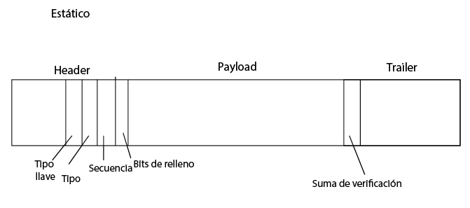
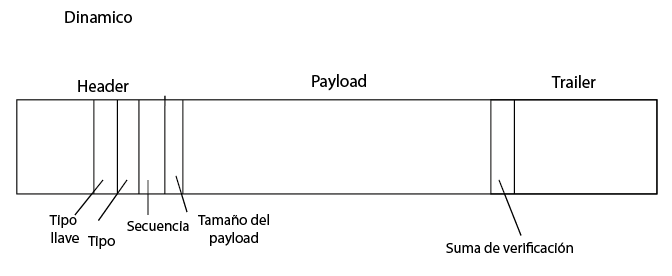

# Tecnológico de Costa Rica
## Ingenieria en Computación
### IC-7602 - Redes - II Semestre 2022
### Prueba Corta 7 y 8
### Isaac David Ortega Arguedas | 2018189196
---
1. Lucky Starr Tech se encuentra desarrollando un protocolo que permita el envío de datos sobre un medio poco confiable, este medio puede verse afectado por radiación
electromagnética de aparatos y otros medios de comunicación. En calidad Ingeniero
o Ingeniera en telecomunicaciones, a usted se le ha encargado diseñar la trama que
será utilizada por el protocolo, algunos detalles importantes (70 pts) :
    * Los identificadores de destino y fuente tienen un total de 6 octetos cada uno.
    * El tamaño máximo del payload (datos) que puede llevar la trama es de 160 bytes, esto debido a que tramas muy grandes pueden causar muchos problemas.
    * El contenido puede ir encriptado con llave pública/privada.
    * Se debe garantizar la entrega en orden de las tramas.
    e. Se debe verificar que los datos estén correctos.
    * Se debe tomar en cuenta que pueden existir diferentes tipos de tramas.
    * Se debe hacer una propuesta con trama de tamaño variable (entre 0 y 160 octetos) y otra con trama de tamaño fijo.
    * El header incluyendo la verificación debe ser lo más pequeño posible, se debe trabajar bajo el supuesto de que la trama debe ser lo más pequeña posible.

    Su propuesta debe hacer un uso eficiente del espacio, debe especificar cuántos bits se van a usar por campo en su trama.

El header ocupa 10 bytes, los 6 del destino, 1 del tipo de llave, 1 del tipo de trama, 1 del numero de secuencia y 1 para indicar cuantos bits de relleno tiene.
Un payload de 160 bytes y un trailer de 7 bytes, 6 de la fuente y 1 para la suma de paridad.

El header ocupa 10 bytes, los 6 del destino, 1 del tipo de llave, 1 del tipo de trama, 1 del numero de secuencia y 1 para indicar el tamaño del payload.
Un payload de de longitud variable entre 0 y 160 bytes y un trailer de 7 bytes, 6 de la fuente y 1 para la suma de paridad.

2. Explique detalladamente la razón por la cual Internet Protocol se implementa como
un servicio sin conexión en lugar de un servicio orientado a conexión (30 pts)

Desde un inicio se diseño con la interconexión de redes en mente. Tiene como objetivo proporcionar un medio de mejor esfuerzo, por lo que no se garantiza la entrega de paquetes, sin importar si el destino se encuentra en la misma red o en una distinta. Ya que las redes pueden llegar a ser muy distintas entre sí, se requeria una forma de transportar la información a traves de la red, y ya que el medio no es confiable se deben tomar medidas para contrarestar esto, ejemplo de esto ciendo la divición de la información a transmitir en entramados los cuales almacenan los datos para poder ser organizados una vez llegan al destino o la posibilidad de poder transportarse por la conexión que deseen.

## Bibliografia
Tanenbaum, A. (2003). *Redes de computacion. Cuarta edicion*.