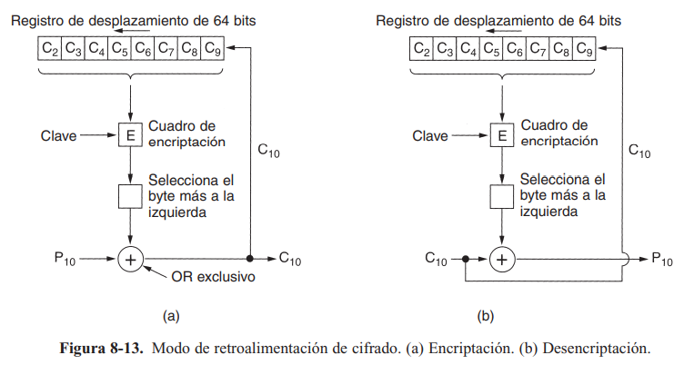
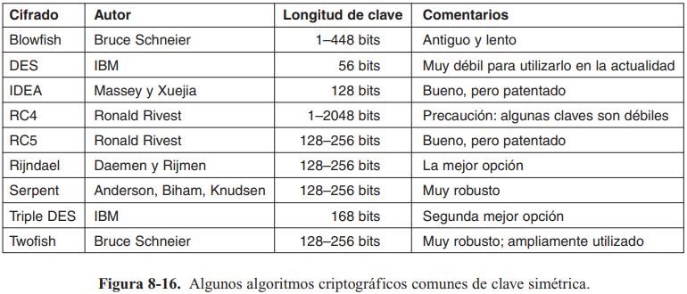

# Resumen #6 y #7.
IC-7602 - Redes 

Zhong Jie Liu Guo - 2018319114

Profesor Gerardo Nereo Campos Araya

Escuela de Ingeniería en Computación - ITCR

Fecha: 8 de noviembre de 2022
## ------------------------------------------------
En este enfoque moderno, trata de que el algoritmo de encriptación sea lo más complicado y rebuscado posible para que se necesite la clave obligatoriamente para entenderlo. Los algoritmos pueden ser implementados en el hardware.

## 8.2. Algoritmos de clave simétrica
* Utilizan la misma clave para encriptar y desencriptar
* Se pueden utilizar dos métodos:
    * Transposiciones: Ej: tomar 8 bits y luego colocar cada bit en posiciones distintas (una caja P). Sigue el principio de Kerckhoff: el atacante sabe que se está permutado, no sabe cómo lo hace.
    * Sustituciones (Caja S): Ej: un texto de 3 bits y sale un texto cifrado de 3 bits. Se tiene una primera caja que transforma los 3 bits a 8 bits. Luego, pasa por una caja P. Finalmente codifica en binario de nuevo la entrada.
    * Cifrado de producto: secuencia en cascada de las dos anteriores.

### DES (Estándar de Encriptación de Datos)
* Texto se encripta en bloques de 64 bits.
* La clave es de 56 bits y tiene 19 etapas diferentes (iteraciones).
* La primera etapa es una transposición sin tomar en cuenta la clave.
* Las 16 etapas se parametrizan con diferentes funciones de la clave. 
    * Se aplica una clave diferente en cada etapa (hace una transposición de los 56 bits).
* La penúltima etapa los 32 bits de la izquierda con los 32 bits de la derecha.
* La última etapa es la inversa de la transposición.
* Blanqueamiento: técnica para fortalecer el algoritmo.
    * Aplicar un OR exclusivo a una clave aleatoria de 64 bits con cada bloque de texto llano antes de dársela al DES
    * Después aplicar un OR exclusivo a una segunda clave de 64 bits con el texto cifrado antes de transmitirla.

### Triple DES
* Se utilizan dos claves (K1, K2) y tres etapas.
    1. el texto se encripta por DES con la K1.
    2. se ejecuta DES en modo desencriptación con la K2.
    3. hace otra encriptación DES con K1.  
* Encriptación: Encriptar-Desencriptar-Encriptar.
* Desencriptación: Desencriptar-Encriptar-Desencriptar.

### AES (Estándar de Encriptación Avanzada)
* Algoritmo Rijndael ganó
    * claves y tamaños de bloques de 128 a 256 bits en pasos de 32 bits.
    * Arreglo state: donde va a estar el texto llano, se copia por columna.
    * Las claves de ronda(rk[num]) se calculan mediante una rotación repetida y aplicado OR exclusivo a varios grupos de bits de clave.
    * Ej: un arreglo que va a ser 4x4.
    * Antes de comenzar los pasos: se aplica un OR exclusivo a rk[0] dentro de state, byte por bute.
    * El ciclo ejecuta 10 iteraciones. Cada ronda tiene cuatro pasos.
        1. Realiza una sustitución byte por byte sobre state. Cada bute se utiliza a la vez como un índice en una caja S para reemplazar su valor por el contenido de entrada de la caja S.
        2. Gira a la izquierda cada una de las cuatro filas. (fila 0 gira 0 bytes, fila 1 gira 1 byte, ...).
        3. Mezcla cada una de las columnas utilizando multiplicación de matrices.
        4. Aplica OR exclusivo a la clave de esta ronda dentro del arreglo state.
    * Desencriptación se puede lograr ejecutando el algoritmo inverso.

### Modos de cifrado
* Modo de libro de código electrónico (ECB)
    * Un texto grande se divide en bloques consecutivos de n bytes (ej: 8 bytes), luego se cifra cada uno con la misma clave.
    * La última pieza se rellena a 64 bits si es necesario.
* Modo de encadenamiento de bloques de cifrado
    * A cada bloque de texto llano se le aplica un OR exclusivo con el bloque anterior de texto cifrado antes de ser encriptado.
    * Al primer bloque se le aplica un OR exclusivo con un vector de inicialización de forma aleatoria, este se transmite en texto llano con el texto cifrado. 
* Modo de retroalimentación de cifrado
    * Para la encriptación byte por byte.
    * Se requiere un vector de inicialización para comenzar.
    Modo de retroalimenatción de cifrado(p. 748)
    
* Modo de cifrado de flujo
    * Usado cuando un error de transmisión de 1 bit arruina 64 bits de texto llano.
    * Funciona encriptando un vector de inicialización y usando una clave para obtener un bloque de salida.
    * El bloque se encripta usado la clave para tener un segundo bloque de salida. Y así sucesivamente.
    * Llamado flujo de claves, se trata como un relleno de una vez y se aplica un OR exclusivo con el texto llano para obtener el texto cifrado.
    * Nunca utilizar el mismo par (clave, IV) con un cifrado de flujo, puede dar un ataque de reutilización de flujo de claves.
* Modo de contador
    * Cuando se desea acceder a datos encriptados de forma aleatoria.
    * Primero se encripta el vector de inicialización(IV) mas una constante, luego se le aplica un OR exclusivo con el texto llano.
    * Por cada nuevo bloque, se incrementa en 1 el IV.
    * Las claves y IVs deben ser elegidos de forma aleatoria por seguridad.

### Otros cifrados
Otros algoritmos de clave simétrica (p. 751)

### Criptoanálisis
* Diferencial
    * se puede atacar cualquier cifrado en bloques.
    * observar un par de bloques de texto llano que difieran en una pequeña cantidad de bits y ver lo que ocurre en cada iteración interna.
* Lineal
    * funciona aplicando un OR exclusivo a ciertos bits del texto llano y el texto cifrado en conjunto, luego tratar de encontrar patrones en el resultado.
    * Si no hay un tipo de desviación, si se repite se va a tener la mitad de los bits en 0s y la otra en 1s.
* Análisis del consumo de energía electrica
    * En general, una computadora usa 3 voltios para representar un bit 1 y 0 voltios para un bit 0. 
    * Si se cambia el reloj principal por uno lento y tener una medida de la energía gastada, se puede conocer bien lo consumido por cada instrucción de la máquina.
* Análisis de temporización
    * Los algoritmos están llenos de condiciones *if*  para probar bits en las claves de ronda. 
    * Si los *then* y *else* toman diferencias de tiempo y se toma en cuenta el tiempo que se toman en ejecutar varios pasos, se puede deducir las claves de ronda.

## 8.3. Algoritmos de clave pública
* Se basa en tener el algoritmo de encriptación y una clave que sea pública.
* El algoritmo de desencriptación y otra clave van a ser privadas.
* Esto requiere que cada usuario tenga dos claves: una pública para encriptar mensajes y una privada para desencriptar los mensajes.
* Deben tener estos tres requisitos:
    1. D(E(P)) = P: se aplica *D* a un mensaje cifrado *E(P)* va a obtener P.
    2. Es excesivamente difícil deducir *D* de *E*.
    3. *E* no puede descifrarse mediante un ataque de texto llano seleccionado.

### RSA 
* Requiere claves de al menos 1024 bits, lo hace lento.
* Basado en ciertos principios de teoría de números.
    1. Seleccionar dos números primos grandes, *p* y *q* (generalmente de 1024 bits).
    2. Calcular `n = p x q` y `z = (p-1) x (q-1)`.
    3. Seleccionar un número primo con respecto a *z*, con nombre *d*.
    4. Encontrar *e* tal que `e x d = 1 mod z`
* Se divide el texto llano en bloques de k bits.
* Para encriptar un mensaje *P*, calculamos `C = P^e (mod n)`. Se requieren *e* y *n*.
* Para desencriptar, calculamos `P = C^d (mod n)`. Se requieren *d* y *n*.
* La seguridad se basa en factorizar *n* que es un número grande.
* Es muy lento para encriptar grandes cantidades de datos.
* Se utiliza para distribuir claves.

### Otros algoritmos de clave pública
* Mochila
    * Un dueño tiene una gran cantidad de objetos con pesos diferentes.
    * El dueño cifra el mensaje seleccionando secretamente un subgrupo de los objetos y los coloca en la mochila.
    * El peso total de los objetos en la mochila se hace público y la lista de todos los posibles objetos.
* Basados en calcular logaritmos discretos.
* Basados en curvas elípticas.