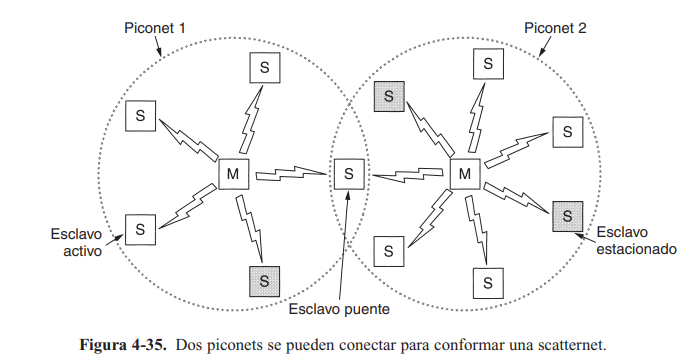

# Resumen 4 y 5.
IC-7602 - Redes 

Zhong Jie Liu Guo - 2018319114

Profesor Gerardo Nereo Campos Araya

Escuela de Ingeniería en Computación - ITCR

Fecha: 25 de setiembre de 2022
## ------------------------------------------------

## 3.5 Verificación de protocolos

### Modelos de máquinas de estado finito
- Cada máquina de protocolo(emisor o receptor) va a estar en un estado específico en cualquier momento. Ese estado pertenece a todos los posibles valores de sus variables incluyendo el contador.
- Los estados se escogen generalmente cuando la máquina está esperando al siguiente evento.
- El número de estados es 2^n, n es el número de bits necesarios para representar todas las variables combinadas.
- Estado del sistema completo: combinación de todos los estados de las dos máquinas de protocolos y del canal. 
- El estado del canal se determina por su contenido. 
- El dicho de que "la trama está en el canal" es abstracto. Una trama pudo haber sido recibida pero no procesada en el destino.
- Transiciones: cambios a otros estados cuando sucede un evento.
- Eventos típicos de un canal
	1. Inserción de una trama nueva en el canal por una máquina de protocolo.
	2. Entrega una trama a una máquina de protocolo.
	3. Pérdida de una trama debido a ruido.

- Estado inicial: estado cuando el sistema empieza a funcionar o en un punto conveniente poco después.
- Análisis de asequibilidad: determinar los estados alcanzables y los no alcanzables. Determinar la correctitud de un protocolo.
	- Protocolo incompleto: la maquina no indica la siguiente acción en cierto estado con cierta trama.
	- Bloqueo irreversible: si hay un grupo de estados donde no hay una salida y no puede avanzar.
	- Transición ajena: una especificación de protocolo que maneja un evento donde no debe hacerlo.

#### Representación

Cuádruple (S, M, I, T)
* S: conjunto de estados existentes de los procesos y el canal.
* M: conjunto de tramas que pueden intercambiarse a través del canal.
* I: conjunto de estados iniciales de los procesos.
* T: conjunto de transiciones entre los estados.

Requisitos de un protocolo con un número de secuencia de 1 bit
- Sin importar la secuencia de eventos, el receptor nunca debe entregar dos paquetes impares sun haber intervenido un paquete par, y viceversa.
- No debe haber rutas en las que el emisor pueda cambiar de estado dos veces mientras el estado del receptor permenezca constante. Si existe tal ruta, los paquetes se pierden.
- Ausencia de bloqueos irreversibles. Puede darse por dos propiedades.
	1. No hay transición hacia fuera del subconjunto.
	2. No hay transiciones en el subconjunto que causen un avance.

#### Diagrama de estados (p. 231)

### Modelos de red de Petri
- Cuatro elementos básicos:
	* lugares: representa un estado de alguna parte del sistema.
	* transiciones: barra horizontal o vertical, se habilita cuando hay al menos un token de entrada en cada uno de los lugares. Pueden disparar un token a voluntad.
	* arcos: entre cada transición se tienen cero o más arcos de entrada y cero o más arcos de salida.
	* tokens: punto grueso, se depositan en los lugares

#### Diagrama de red de petri (p. 232)

- La detección de fallas es similar a las máquinas de estados finitos.
	1. Sin importar la secuencia de eventos, el receptor nunca debe entregar dos paquetes impares sin haber intervenido un paquete par, y viceversa.
	2. Bloqueo irreversible.

#### Representación
- De forma algebraica.
- Cada transición es una regla de la gramática
- Cada regla especifica lugares de entrada y salida de la transición.

## 4.6 Bluetooth

Fue un proyecto que tenía el propósito de crear un estándar inalámbrico que interconectara computadoras, dispositivos de comunicación y accesorios por medio de ondas de bajo consumo de energía, corto alcance y económicos.

### Arquitectura
- Piconet: unidad básica de un sistema Bluetooth, consta de un nodo maestro y hasta siete nodos esclavos activos a una distancia de 10 metros.
- La conexión entre piconets se da por medio de un nodo puente. Un conjunto de piconets interconectadas se llama scatternet.

#### Dos piconets formando un scatternet (p. 311)

- Puede haber hasta 255 nodos estacionados en la red que están en modo de consumo bajo. Estos pueden responder ante una señal de activación del maestro. Pueden tener dos estados intermedios: *hold* y *sniff*.
- Se volvió un sistema centralizado donde el nodo maestro hace todo, incluyendo las comunicaciones entre esclavos.

### Aplicaciones (perfiles)

### Pila de protocolos (p. 314)

- Capa inferior: Capa de radio física, se encarga de la transmisión y modulación de radio.
- Capa de banda base: se encarga de la forma en que el nodo maestro controla las ranuras de tiempo y su agrupación en tramas.
	- Administrador de enlaces: establecer canales lógicos entre dispositivos (energía, autenticación, calidad).
	- Protocolo de adaptación y control de enlaces lógicos (L2CAP): aislar las capas superiores de los detalles de la transmisión.
	- Protocolo de audio y control: auto-explanatorio.
- Capa middleware: compatibilidad con las redes 802.
	- RFcomm: emula el puerto serie estándar de las PCs para la conexión de teclados, ratones y módems, entre otros.
	- Telefonía: Para los tres perfiles de voz, se encarga del establecer y terminar llamadas.
	- Descubrimiento de servicios: localizar servicios dentro de la red.
- Capa superior: donde se ubican las aplicaciones y perfiles.

### Capa de radio
- Traslada los bits del nodo maestro al esclavo y viceversa. 
- Rango de 10 metros con banda ISM de 2.4 GHz. 
	- La banda se divide en 79 canales de 1 MHz cada uno.
	- Modulación por desplazacmiento de frecuencia con 1 bit por Hz.
- Para asignar el canal, todos los nodos saltan y el maestro decide la secuencia de saltos.

### Capa de banda base
- Parecido a una subcapa MAC.
- Convierte los bits en tramas y define algunos formatos. 
- Las transmisiones del maestro se dan en las ranuras pares y los esclavos en las impares.
- Enlace: un canal lógico entre el maestro y un esclavo para transmitir una trama. Hay dos tipos:
1. Asíncrono no Orientado a la Conexión (ACL): para datos conmutados en paquetes disponibles a intervalos irregulares.
	- No hay garantías. Las tramas se pueden perder y tienen que retransmitirse.
	- Un esclavo solo puede tener un enlace con el maestro.
2. Síncrono Orientado a la Conexión (SCO): para datos en tiempo real.
	- Se le asigna una ranura fija en cada dirección.
	- Las tramas nunca se retransmiten.
	- Puede utilizar la corrección de errores hacia adelante.
	- Un esclavo puede tener hasta 3 enlaces con el maestro.

### Capa L2CAP
1. Acepta paquetes de máximo 64 KB de capas superiores y los divide en tramas para transmitirlos. Se reensablan en el otro extremo.
2. Maneja la multiplexión y desmultiplexión de varias fuentes de paquetes. Determina cuál protocolo lo va a manejar.
3. Revisar la calidad de los requerimientos de servicio.

### Estructura de trama (p. 316)

* Código de acceso: indentifica al maestro.
* Encabezado: campos comunes de la subcapa MAC. Se repite tres veces.
	* Dirección: identica a cuál de los ocho dispositivos está destinado.
	* Tipo: tipo de trama (ACL, SCO, de sondeo, nula), tipo de corrección de errores en datos, cantidad de ranuras de longitud de la trama.
	* bit F (flujo): cuando el buffer está lleno.
	* bit A (confirmar recepción): añdir un ACK en una trama.
	* bit S (secuencia): numerar las tramas para detectar retransmisiones.
	* Suma de verificación (8 bits): 
* Datos: 2744 bits para una transmisión de cinco ranuras, 240 bits para una sola ranura.