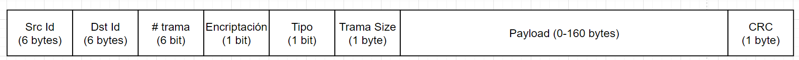

## Prueba Corta #7 y #8
### Redes - IC-7602
### Escuela de Ingeniería en Computación, ITCR
### 1-11-2022
Estudiante
* Zhong Jie Liu Guo - 2018319114

1. En calidad Ingeniero o Ingeniera en telecomunicaciones, a usted se le ha encargado diseñar la trama que será utilizada por el protocolo, algunos detalles importantes:   
 

* El header va a tener un tamaño de 14 bytes para las siguientes características:
    * Los identificadores de destino (Dst Id) y fuente (Src Id) con 6 bytes cada uno para cumplir con el formato de una dirección MAC.
    * Para asegurarse de una entrega ordenada de las tramas se usa el # trama. El máximo de tramas que puede referenciar son 64 tramas diferentes con 6 bits.
    * Para indicar si la información viene encriptada, se usa 1 bit para la presencia o ausencia de esta.
    * El tipo de trama va a interpretarse de dos formas: una trama dinámica o estática. Como es una opción binaria se puede usar 1 bit.
    * Las tres anteriores pueden asignarse en un solo byte.
    * El tamaño del payload de la trama va a ser importante para cualquier tipo de trama (dinámica o estática) para saber cuánta información lleva. Como esta puede llevar hasta 160 bytes, entonces se va a asignar 1 byte (8 bits o 256 valores) para representarlo. Un byte es el valor mínimo para poder capturar la cantidad de 160.
* El payload va a tener un tamaño fijo reservado de 160 bytes máximo sin importar el tipo de trama que sea. Ahora, dependiendo del tipo y en conjunto con el Trama Size, este va a llenarlo con la información que se necesite y si queda espacio, se rellenan de 0s.
* El trailer va a tener el CRC para verificar la validez de los datos utilizando 1 byte.

2. Explique detalladamente la razón por la cual Internet Protocol se implementa como un servicio sin conexión en lugar de un servicio orientado a conexión.
  

La razón que puede influir en esta implementación es que el medio por el cual el Internet Protocol va a interactuar con in internet el cual es de naturaleza distribuida y gigantesca, además de que sigue expandiendo con el pasar del tiempo. Esto hace que sea un ambiente muy poco confiable ya que está en constante cambio y expansión. Añadiendo que no se puede garantizar con certeza que un paquete vaya a llegar de la misma forma o el mismo camino que otro. Otro asunto que surge de esta cuestión es que como la red es casi imposible ver quiénes son los miembros que pertenecen a la misma, no hay un algoritmo que se pueda aplicar de forma eficiente para hacer un análisis en la red.

&nbsp;&nbsp; 