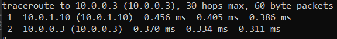

# Instituto Tecnológico de Costa Rica  
## Escuela de Computación  
## IC 7602 - Redes - GR 2  
## Proyecto 1
## Profesor: Gerardo Nereo Campos Araya  
## Estudiantes:

- Ary-El Durán Ballestero | 2018102445
- Isaac David Ortega Arguedas | 2018189196
- Mario Fernández Robert | 2018163975
- Zhong Jie Liu Guo | 2018319114

## Fecha de Entrega 21/10/2022
---

## Objetivo General
El objetivo de este proyecto es el de implementar redes locales virtuales (VLAN) mediante la configuración de servicios de red. Esta red local debe contar con routers, servidores DHCP, servidor de DNS y servidor VPN. Además, implementa reglas de enrutamiento, reglas de firewall, implementa y configura un proxy reverso e instala Web Servers con sitios básicos.
El proyecto debe automatizar toda la configuración e instalación mediante ```docker-compose``` y ```shell scripts```. Así como utilizar herramientas de diagnóstico de redes.
## Descripción
Con el fin de lograr el objetivo, se deben implementar dos pequeñas redes virtuales que exponen diferentes servicios, toda la configuración debe ser implementada mediante ```Docker``` y ```docker-compose```.
### Redes 
Se cuenta con dos redes, cada una tiene su respectivo nombre, número de red y máscara.
### Routers
Se encargan de darle acceso a internet a su respectiva LAN Virtual, además manejan el tráfico de salida permitido. Permiten el acceso externo mediante puertos especificados en la asignación. Se decidio usar las direcciones ```10.0.0.10``` y ```10.0.1.10``` para los routers 1 y 2 respectivamente, esto se debe a que por defecto, docker utiliza la primer dirección (X.X.X.1).
### DNS
Implementa tres zonas. Cada componente en las redes tendrá una entrada en su respectiva zona. Como forwarder, se utilizarán los ```8.8.8.8``` y ```8.8.4.4```. Esto cambio, pues se presentaron ciertos problemas con el forwarder ```8.8.4.4``` por lo que se decidió utilizar el ```8.8.8.9``` sustituyendo a ```8.8.4.4```.
### DHCPs
Ambos componentes prestan el servicio de configuración dinámica de host en sus respectivas redes, entre 
los parámetros a ofrecer se encuentra la IP, configuración de red, DNS y default gateway. 
### Clientes
Al iniciar un cliente en alguna de las redes, estos deberán poder configurar su red automáticamente,
obtener un nombre de dominio y tener acceso a la red, también deben poder validar las reglas definidas 
por todos los demás componentes.
### Web Servers
Se deberán implementar dos Web Servers en Apache, estos exponen una simple página y pueden ser accesados mediante www.google.com/web1 y www.google.com/web2.
### Proxy Reverso
Implementará un routeo por hostname, cuando alguien ingrese a www.google.com/web1
mostrará la página de Web Server1 y cuando lo haga a la página www.google.com/web2 mostrará la 
página de Web Server2.
### VPN
Se deberá implementar con la tecnología OpenVPN, el mismo permitirá acceder a los recursos internos de ambas redes y permitirá realizar el enrutamiento de todo el tráfico de Internet.
### Web Cache
Actuará como un Web Proxy Cache transparente, este mantendrá un caché con políticas de expiración de 
todo el tráfico HTTP y HTTPs, estará configurado automáticamente para todos los clientes de la red.
## Diagramas 
### Diagramas de arquitectura
La base de este programa se tomó de la especificación del proyecto. Es bastante similar en el sentido de los puertos y las conexiones.


## Prerequisitos
Para este proyecto, se asume que tiene instalado los siguientes programas:

- Docker Desktop(ver [link](https://www.docker.com/))

## Manual de usuario
En este proyecto realmente solo se necesita correr un comando que seria ```docker-compose up --build```, este se debe ejecutar en el directorio base del proyecto, el comando se encargara de construir, o descargar las imágenes necesarias para ejecutar el proyecto y creando así contenedores a partir de las imágenes, si se ejecuta correctamente, se podrá tener acceso a las terminales de cualquier contenedor para correr las pruebas necesarias.

Si el usuario ya tiene las imágenes creadas y solo quiere levantar la estructura sin crear o bajar las imágenes se usa el comando ```docker-compose up```.

En el caso donde se quiera bajar los contenedores y las redes creadas por docker, se deberá usar el comando ```docker-compose down```.

## Pruebas unitarias
### Creación de Containers

Los containers se crean de manera exitosa y en el orden especificado por el profesor.

<!--  -->

### Clientes reciben IPs correctos
### Corridas del comando PING en ambos clientes
- Cliente 1


- Cliente 2


### Corrida de TRACEROUTE para asegurarse de que se estén tomando las rutas correctamente
- Cliente 1


- Cliente 2


### Corridas del comando NSLOOKUP en ambos clientes
- Cliente 1


- Cliente 2


### Salvado de los CURLs en el web caché
### Pruebas realizadas con TELNET
## Recomendaciones

1. Al momento de implementar zonas, se debe de tener especial cuidado con la configuración de estas. Ya que es sencillo cometer errores, los cuales serán muy difíciles de encontrar a futuro.
2. Utilizar `traceroute` si se desea saber si un componente, del cual conocemos su IP, está conectado a la red.
3. Utilizar `nslookup` como herramienta de checkeo de DNS, mediante la misma podremos saber si se configuró correctamente la misma.
4. Documentar abundantemente las reglas del router, ya que es muy sencillo perderse en las mismas y no poder diferenciar una regla de la otra.
5. Instalar distintas herramientas en los clientes para poder evaluar el correcto funcionamiento del proyecto.
6. Monitorear constantemente los logs de cada container para observar el comportamiento del mismo en caso de errores o bugs inesperados.
7. Realizar un diagrama de arquitectura previamente y estarlo actualizando constantemente para el correcto desarrollo en paralelo.
8. Realizar consultas constantes con un experto en estas tecnologías (en este caso es el profesor) para despejar dudas que no son fácilmente respondidas por la información en internet.
9. Utilizar herramientas online para la generación de archivos de configuración y usarlos como machotes para guiar a los estudiantes.
10. Tener mucho cuidado al buscar guías de instalaciones de las tecnologías pedidas ya que hay detalles que no se denotan en ellas por varias razones como que las imagen de ubuntu no tiene algunos componentes cuando en la guía se asume que es un sistema operativo completo. También, la instalación se orienta a una versión específica de linux y puede que no sirva en otras. 

## Conclusiones

1. Este proyecto es de gran utilidad para conocer en mayor profundidad como funcionan las redes locales.
2. Docker es una herramienta sumamente flexible en temas de redes que se puede lograr virtualizar redes locales.
3. Se lograron crear conexiones entre varias "máquinas" o contenedores que poseían programas diferentes y se logró proporcionar conexiones entre ellas.
4. El router va a ser el medio por el cual todo componente en cada red podrá comunicarse a otras redes y al mundo exterior (internet). Para esto se establecieron reglas de entrada, salida, forwarding, prerouting y postrouting para dar diferentes servicios.
5. El uso del caché puede llegar a ser bastante provechoso, ya que estos pueden ayudar a disminuir el consumo de ancho de banda.
6. El equilibrio de carga puede ser útil si se desea evitar sobrecargar una página y/o servidor. No obstante, Round Robin no es el mejor método para esto. 
7. Tener un proxy reverso puede aligerar la carga de nuestros servidores de sobremanera, además de ser fáciles de implementar.
8. El comando `traceroute` nos permite ver los hops que se realizan entre routers, cuando se realiza una petición a un endpoint, esto es muy útil, pues podemos ver si existe algún hop innecesario que afecte el rendimiento.
9. Un web server daemon puede ser muy útil para una implementación sencilla y rápida.
10. Se implementaron dos redes lan con las características pedidas en la especificación del proyecto al tener que *lan1* tuviera conexiones con una red bridge y la *lan2*, y que la *lan2* solo tuviera acceso al internet por medio del router de la *lan1*.


## Referencias bibliográficas

- https://bobcares.com/blog/iptables-nat-masquerade/ 

- https://www.hostinger.com/tutorials/iptables-tutorial

- https://kifarunix.com/install-and-setup-openvpn-server-on-ubuntu-22-04/

- https://ubuntu.com/server/docs/service-domain-name-service-dns
 
- https://www.techrepublic.com/article/how-to-use-nginx-as-a-reverse-proxy-for-apache/

- https://www.theserverside.com/blog/Coffee-Talk-Java-News-Stories-and-Opinions/How-to-dockerize-Apache-httpd-web-servers