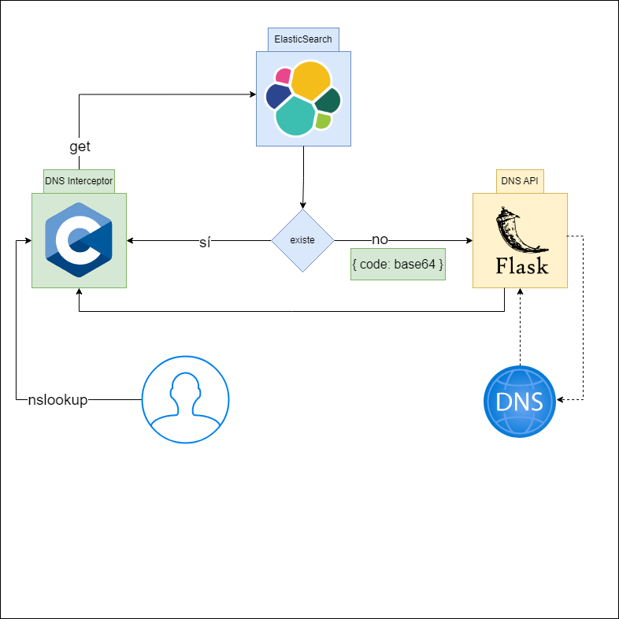
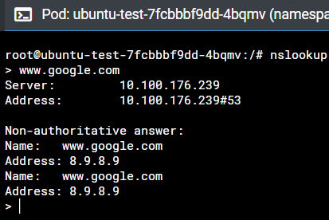
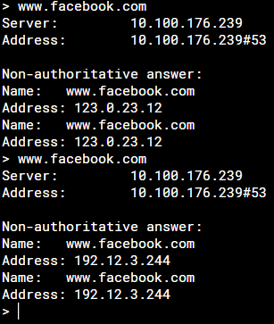
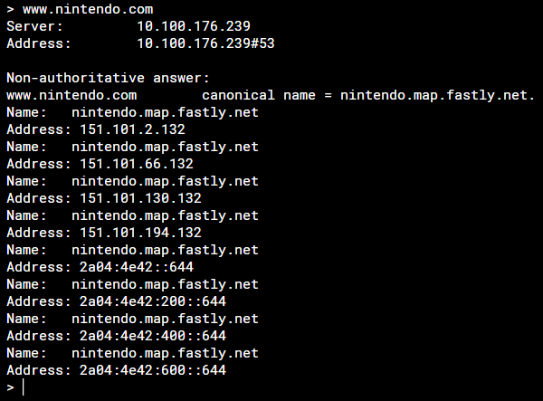
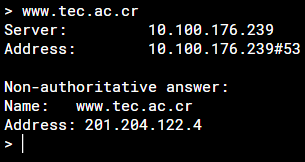
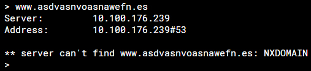

# Instituto Tecnológico de Costa Rica  
## Escuela de Computación  
## IC 7602 - Redes - GR 2  
## Proyecto 2
## Profesor: Gerardo Nereo Campos Araya  
## Estudiantes:

- Ary-El Durán Ballestero | 2018102445
- Isaac David Ortega Arguedas | 2018189196
- Mario Fernández Robert | 2018163975
- Zhong Jie Liu Guo | 2018319114

## Fecha de Entrega 25/11/2022
---

## Objetivo
El objetivo de este proyecto es el de implementar servicios de capa de aplicación sobre protocolos de transporte UDP y TCP. Para esto se debe desarrollar servidores UDP y TCP en lenguajes de programación C y Python respectivamente, además de, implementar el procesamiento de algunas peticiones DNS especificadas en RFC-2929. Todo esto teniendo que resultar en una solución automatizada mediante el uso de Docker, Docker Compose, Helm Charts y Kubernetes.

## Descripción
Ya que el proyecto II busca profundizar los temas de capa de aplicación y capa de transporte mediante la implementación de aplicaciones que utilicen protocolos TCP y UDP, se deberá implementar los siguientes componentes:
### DNS Interceptor:
Este es un Deployment, cada pod tendrá una pequeña aplicación  C, que escuchará en el puerto UDP/53, esta aplicación recibirá paquetes del protocolo DNS. Deberá examinar el paquete recibido siguiendo la especificación oficial en el RFC2929 y tomar alguna de las siguientes acciones:

1. **Paquete diferente a query estándar:** codifica el paquete a **base64** y via HTTPS se lo envia al NDS API, la respuesta recibida estara en **base64**, esta debe ser decodificada y enviada al cliente solicitante.

2. **Paquete query estándar:** examinarlo detenidamente e identificar el host que se esta tratando de resolver, una 
vez que el host ha sido identificado, deberá buscar en Elasticsearch si un registro para este host existe y tomar alguna de las siguientes acciones:
    
    *  Si existe, deberá extraer la información de esta base de datos y retornar la información, este debe cumplir con la especificación del protocolo en RFC2929.
    * En caso de no existir, la solicitud se trata como el primer caso.
### DNS API:
Este es un Deployment, cada pod contiene container que ejecuta un REST API implementado en Python, que ejecuta un único método en un único verbo HTTP, este único método recibe en el data un paquete DNS (RFC2929) codificado en 
base64, este deberá ser decodificado y enviado a un servidor DNS remoto para su resolución, esto implica lo siguiente:
    
* Esta aplicación deberá implementar un REST API, que a su vez implemente un cliente UDP/DNS para enviar las solicitudes hacia el servidor DNS remoto.
* Esta aplicación deberá recibir como parámetro/archivo de configuración el IP de un servidor DNS remoto.
* Esta aplicación deberá soportar múltiples peticiones al mismo tiempo.
### Elasticsearch/Kibana:
Es un componente que no se tiene que implementar pero que si debe instalarse y configurarse mediante el uso de Docker, Docker compose, Helm Charts y Kubernetes. En este componente deberán existir los siguientes recursos:

    * Un índice llamado zones. Este va a tener el siguiente formato:
    * Documentos dentro de este índice que representan hosts, estos tendrán el siguiente formato: 
    {
            "hostname": "www.facebook.com",
            "TTL": 5,
            "IP": "10.12.41.1, 192.12.3.244, 123.0.23.12",
            "index": 0
    }
    * Estos documentos se pueden crear, borrar o modificar en cualquier momento mediante Kibana.
## Diagramas

> Diagrama de arquitectura/flujo

## Prerequisitos
Para este proyecto, se asume que tiene instalado los siguientes programas:

- Docker Desktop(ver [link](https://www.docker.com/))
- Kubernetes ([Habilitar Kubernetes desde Docker Desktop](https://docs.docker.com/desktop/kubernetes/))
- Helm ([ver instalación](https://helm.sh/docs/intro/install/))
- kubectl (Si no se instala por defecto, vea [link](https://kubernetes.io/docs/tasks/tools/))
- (Opcional) Lens (ver [link](https://k8slens.dev/))

## Manual de usuario
### Instalación
La instalación del proyecto comenzará ubicándose en la carpeta principal **Proyecto2**. Para comprobar el buen estado de los pods, se usará Lens para verlo fácilmente. Luego, se siguen los siguientes pasos:
1. Configurar los operadores de ECK (si ya los tiene, omita este paso). Correr el siguiente comando:
    > helm install eck-deployment ./eck-deployment/

2. Configurar Elastic y Kibana
    * Para facilitar su operación y no tener problemas de ErrPullImage, se recomienda hacer un pull a las imágenes de elastic y kibana usando:
        * `docker pull docker.elastic.co/elasticsearch/elasticsearch:8.4.0`
        * `docker pull docker.elastic.co/kibana/kibana:8.4.0`
    * Luego, se usa el siguiente comando (Puede tardar varios minutos, comprobar en Lens para seguir con el siguiente paso):
    > helm install elastic-deployment ./elastic-deployment/
    * El servicio de kibana va a estar en la dirección `localhost:30601`.
    * Luego, va a aparecer un log-in, el usuario es **elastic** y la contraseña puede averiguarse corriendo el siguiente comando: `kubectl get secret quickstart-es-elastic-user -o=jsonpath='{.data.elastic}' | base64 --decode; echo`. Si está en Windows, se recomienda correrlo en una terminal de WSL o de Unix. También, se puede buscar en Lens con el nombre **quickstart-es-elastic-user** en la sección de Secrets.
    * Luego en **Dev Tools**, se debe correr el *elastic-script.txt* en la consola proporcionada por kibana para crear y llenar la BD.

3. Configurar el DNS API, DNS Interceptor y cliente.

    * (Opcional) Las imágenes necesarias son sacadas de Docker Hub por lo que no es necesario hacer un build. Pero, si se desea usar imágenes locales se puede usar docker-compose para crear las imágenes con el siguiente comando:
    > docker-compose build

    * Se instalan el API, el Interceptor y el cliente en el cluster de kubernetes
    > helm install app-deployment ./app-deployment

4. Si se desea hacer un cambio de configuración, se debe usar el comando `helm upgrade name-deployment ./name-deployment` (ej: `helm upgrade app-deployment ./app-deployment`).

5. Si se eliminar un helm chart, se debe usar el comando `helm delete name-deployment` (ej: `helm delete app-deployment`).

### Programas a utilizar (en localhost y/o port)
1. Kibana: abrir un navegador y ingresar a `localhost:30601`. Con esto, se puede interactuar con Elasticsearch.
2. DNS interceptor: se expone en el puerto `30053` en la máquina local. Para interactuar con este, se puede usar nslookup con el siguiente comando `nslookup -port=30053`. Luego, se ingresa los siguientes keywords `> server 127.0.0.1`. Luego, se ingresa los hostnames deseados.
3. Client: Se le proporciona un cliente ubuntu en el cluster de Kubernetes. para usarlo se recomienda usar Lens para abrir un **Pod Shell** y usar el comando `nslookup`. Como se hizo transparente, solamente debe ingresar los hostnames que sea revisar.
4. DNS API: el api tiene su propia documentación y se puede acceder al abrir un navegador e ingresar `https://localhost:30050/swagger`.

## Pruebas unitarias
Para las pruebas se va a usar el Client proporcionado (el programa 3 en la sección anterior). 

1. Buscar un hostname en elasticsearch con solo un ip.

2. Buscar un hostname en elasticsearch con más de una ip.

3. Buscar un hostname que no está en elasticsearch.

4. Buscar un hostname que no está en elasticsearch.

5. Buscar un hostname raro.

## Recomendaciones

- Utilizar libb64 para el encoding a base64 de los paquetes en C.
- Utilizar la implementacion del MIT para el decoder de base64 en C.
- Preparar un script con querys de elastic search para seedear la base de datos cada vez que se realice una nueva instalacion del proyecto.
- Utilizar los snippets de Postman para referencias de uso de libcurl en C.
- Utilizar el plugin flask-swagger-ui para la documentacion swagger de los endpoints creados.
- Automatizar el proyecto mediante docker y helm.
- Mantener separada cada parte del proyecto para facilitar la ejecución y comprención del código.
- Utilizar una variable de entorno para la contraseña de elastic search y asi facilitar su uso.
- Revisar los elementos que las funciones esperan recibir o deben enviar.

## Conclusiones

- Un DNS funciona escencialmente como una base de datos, la cual almacena informacion relevante para el cliente solicitante de una resolucion de un dominio.
- Implementar un DNS con un round robin agrega flexibilidad al protocolo y nos deja expandir distintos domain names a un conjunto de ips.
- Los estandares RFC detallan especificamente byte por byte y bit por bit el contenido de los paquetes, es muy importante familiarizarse con la nomenclatura para entender los ASCII tables.
- La automatizacion de los proyectos mediante kubernetes y helm charts crean un beneficio considerable a la hora de expandir o compartir proyectos.
- Para implementar un DNS la opcion mas viable es mantener una base de datos no relacional para mantenerse rapida en respuesta y flexible en forma.
- Base64 es util para el transporte de información que originalmente contenia el caracter "00".
- La existencia de protocolos como el RFC2929 es util para la estandarización y con esto facilitar la creación de nuevavs aplicaciones o transferencia de información.

## Referencias bibliográficas

- libcurl - API. (s. f.). https://curl.se/libcurl/c/
- Malinen, J. M. (2005). Base64 encoding/decoding. web MIT. https://web.mit.edu/freebsd/head/contrib/wpa/src/utils/base64.c
- RFC 2929 - Domain Name System (DNS) IANA Considerations. (s. f.). https://datatracker.ietf.org/doc/html/rfc2929