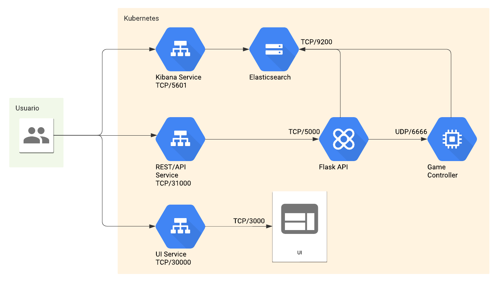
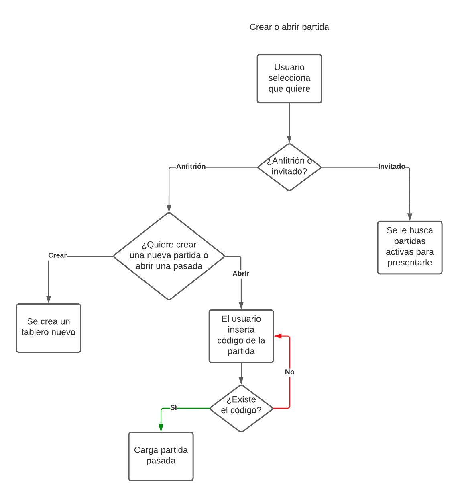
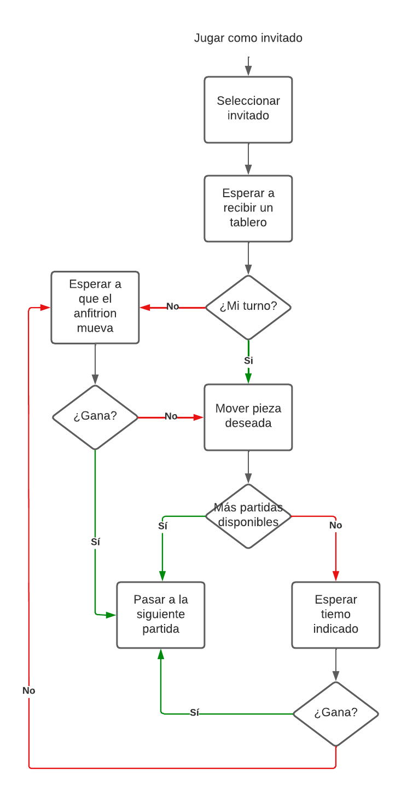
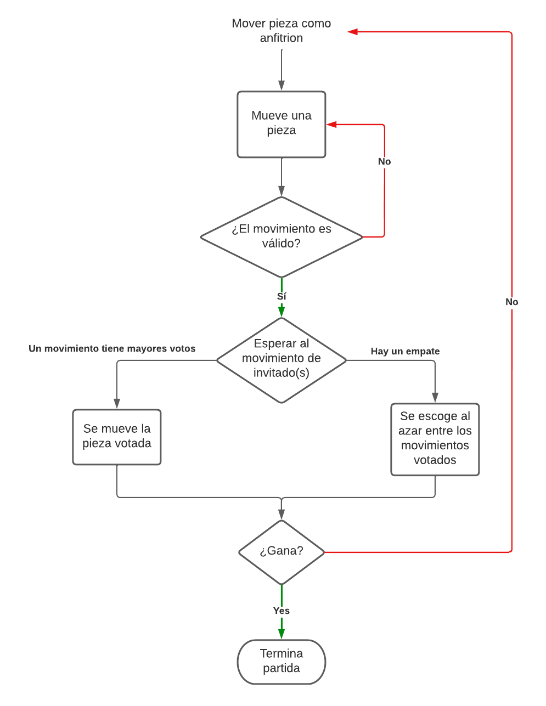

# Documentación - Crazy Chess
## Estudiantes:
*  Ary-El Durán Ballestero | 2018102445
*  Isaac David Ortega Arguedas | 2018189196
*  Zhong Jie Liu Guo | 2018319114

### Diagrama de Arquitectura
La base de este programa se tomó de la especificación del proyecto. Es bastante similar en el sentido de los puertos y las conexiones. 

### Diagramas de Flujo
Para este apartado, se mostrarán tres diagramas para las tres historias de usuario: crear un juego, jugar como invitado y jugar como anfitrión.

### Scripts para comenzar a usarlo
Los comandos se pueden dividir en dos partes: la creación de las imágenes y la corrida en Kubernete. El primero usará el docker-compose que ayudará a construir las imágenes necesarios de las aplicaciones. Por su naturaleza, estos van a correr en contenedores después de la etapa de build. Por lo que se debe cerrar el proceso ya que solo ocupamos las imágenes creadas.
> `cd <a la ruta del proyecto>` \
> `docker-compose up`

Para eliminar las imágenes creadas y todo lo relacionado a ello se usa `docker-compose down --rmi all`.

Ahora, se van a levantar los pods en Kubernete con las imágenes apropiadas utilizando helm charts. Primero hay que dirigirse a la carpeta `app-deployment`. Luego se utiliza el siguiente comando para montar la arquitectura en el Kubernete.
> `## Crear los pods` \
> `helm install app-deployment .` \
> `## Detener y eliminar los pods` \
> `helm delete app-deployment`

### Recomendaciones
1. 
2. 
3. 
4. 
5. 
6. 
7. 
8. 
9. 
10. 

### Conclusiones
1. 
2. 
3. 
4. 
5. 
6. 
7. 
8. 
9. 
10. 