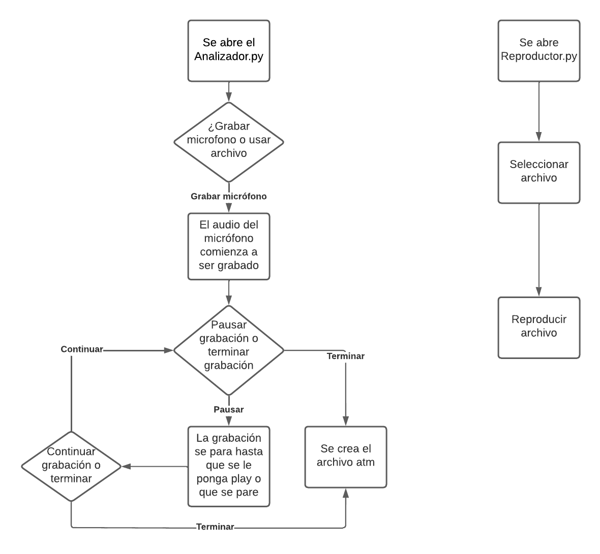
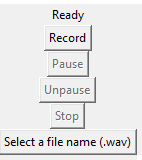

# Instituto Tecnológico de Costa Rica  
## Escuela de Computación  
## Redes GR 2  
## Tarea Corta 1: ¿Por qué las voces de los integrantes son diferentes?  
## Profesor Gerardo Nereo Campos Araya  
## Estudiantes

- Ary-El Durán Ballestero | 2018102445
- Isaac David Ortega Arguedas | 2018189196
- Zhong Jie Liu Guo | 2018319114

## Fecha de Entrega 8/9/2022
---

## Objetivos
El objetivo de esta tarea es el de implementar un analizador de espectro de audio simple. Esto con el fin de profundizar los conceptos de señales y ondas utilizando software para generar la transformada de Fourier, graficar señales de audio en el dominio del tiempo y dominio de frecuencia.
## Descripción
Con el fin de lograr los objetivos, se debe de implementar una solución de software la cuenta con dos funciones:
### Analizador:
Toma señales de audio streaming (captura de micrófono) o batch (archivos WAV) y deberá almacenar el audio, en caso de ser streaming, graficar la señal en el dominio del tiempo del audio, además de, calcular su transformada de Fourier.

Con estos datos se debe graficar en tiempo real los componentes de frecuencia obtenidos mediante la transformada de Fourier y poder ver tanto el gráfico en el tiempo, así como en frecuencia al mismo tiempo. Una vez finalizada la grabación se debe generar un archivo .atm (Autrum File) que contendrá el audio original, junto con los datos usados 
para generar los gráficos en dominio de frecuencia.
### Reproductor:
Toma archivos con extensión .atm y puede reproducir el audio al mismo tiempo que los gráficos en dominio del tiempo y dominio de frecuencia.

## Diagramas 
### Diagramas de arquitectura

### Diagrama de flujo

## Prerequisitos
* numpy
* matplotlib
* pyaudio
* scipy

Para instalar las dependencias, primero, utilizando una terminal,  nos ubicamos en la carpeta "Tarea1_Autrum", luego se usa el siguiente comando:

> `pip3 install -r requirements.txt`

Para correr el programa deseado abralo en su editor de preferencia y luego ejecutelo.

## Manual de usuario
### Analizador

* Record: graba el audio.
* Pause: pausa la grabación.
* Unpause: reanua la grabación
* Stop: terminar la grabación
### Reproductor
## ¿Por qué las voces de los integrantes son diferentes?

Las voces de las personas son diferentes porque no todas llegan a las mismas notas, para esto esta el concepto de rango de voz, algunos pueden llegar a notas más graves mientras otros llegan a notas más agudas.

## Bibliografia
Adi's Technical Aid. (10 de setiembre del 2021). *Play audios using PYAUDIO || PYAUDIO || PYAUDIO tutorial || Adi's Technical Aid* [Video]. YouTube. https://www.youtube.com/watch?v=fVJTrcEqgIo

Code With Aarohi. (18 de abril del 2020). *Record and Play Audios Using PyAudio* [Video]. YouTube. https://www.youtube.com/watch?v=jbKJaHw0yo8

Nikhil Kumar. (22 de julio del 2018). *Working with zip files in Python*. GeeksforGeeks. https://www.geeksforgeeks.org/working-zip-files-python/

Python Tutorial. (S.F.). *Tkinter Open File Dialog*. https://www.pythontutorial.net/tkinter/tkinter-open-file-dialog/

Stackoverflow. (febrero del 2022). *Python: Open file in zip without temporarily extracting it*. https://stackoverflow.com/questions/19371860/python-open-file-in-zip-without-temporarily-extracting-it

W3 Schools. (). *Python JSON*. https://www.w3schools.com/python/python_json.asp