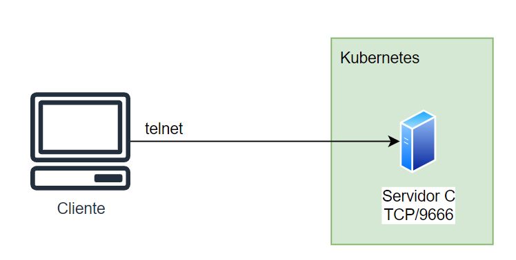
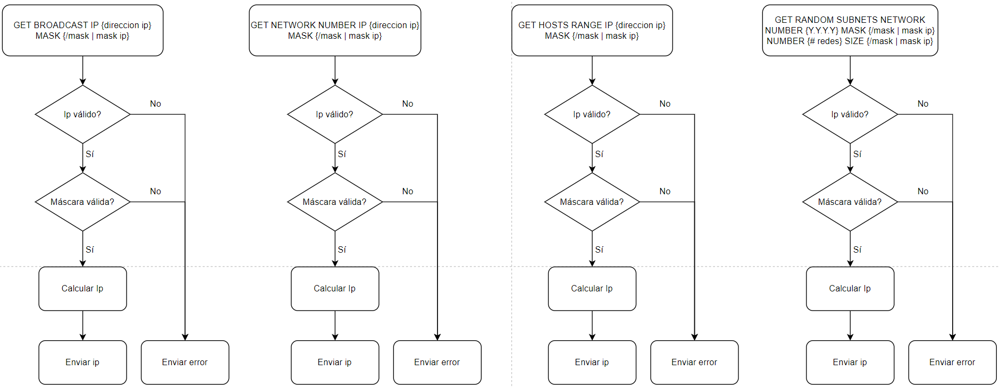

# Instituto Tecnológico de Costa Rica  
## Escuela de Computación  
## IC 7602 - Redes - GR 2  
## Tarea Corta 2: Servidor Calculadora IPs
## Profesor Gerardo Nereo Campos Araya  
## Estudiantes

- Ary-El Durán Ballestero | 2018102445
- Isaac David Ortega Arguedas | 2018189196
- Mario Fernández Robert | 2018163975
- Zhong Jie Liu Guo | 2018319114

## Fecha de Entrega 25/10/2022
---

## Objetivos
El objetivo de esta tarea es el de implementar un servidor en C que hará ciertos cálculos relacionados a una IP4. Esta tarea va a verificar los conocimientos de sockets y operaciones bitwise. 

## Descripción
Con el fin de lograr los objetivos, se debe de implementar una solución de software la cuenta con cuatro funciones:
* GET BROADCAST IP {direccion ip} MASK {/mask | mask ip}: Calcula el ip broadcast.
* GET NETWORK NUMBER IP {direccion ip} MASK {/mask | mask ip}: Calcula el ip de la red.
* GET HOSTS RANGE IP {direccion ip} MASK {/mask | mask ip}: Calcula el rango de ips que se pueden asignar.
* GET RANDOM SUBNETS NETWORK NUMBER {Y.Y.Y.Y} MASK {/mask | mask ip} NUMBER {# redes} SIZE {/mask | mask ip}: Calcula una cantidad *n* de redes de una red con una máscara determinada.

## Diagramas 
### Diagramas de arquitectura

### Diagrama de flujo

## Prerequisitos
* Docker Desktop(ver [link](https://www.docker.com/) )
* Kubernetes ([Habilitar Kubernetes desde Docker Desktop](https://docs.docker.com/desktop/kubernetes/))
* Helm ([ver instalación](https://helm.sh/docs/intro/install/))
* kubectl (Si no se instala por defecto, vea [link](https://kubernetes.io/docs/tasks/tools/))
* (Opcional) Lens (ver [link](https://k8slens.dev/))

## Manual de usuario
Para levantar el servidor, primero debe ubicarse en la carpeta principal. En el caso que **NO** haya una imagen en docker hub, se puede crear usando el comando ``docker build -t tarea2_server ./program"``. En el caso **usual**, solo se debe ejecutar el helm charts usando el comando ``helm install app-deployment ./app-deployment``. Si desea bajar el servidor, se usa el comando ``helm delete app-deployment``.

Para la conexión con el servidor se usará el comando `telnet <ip> <port>` o `telnet localhost 9666` para conectar con el servidor.

## Pruebas unitarias
### Prueba 1: GET BROADCAST CORRECTO

### Prueba 2: GET BROADCAST ERROR

### Prueba 3: GET NETWORK NUMBER CORRECTO

### Prueba 4: GET NETWORK NUMBER ERROR

### Prueba 5: GET HOSTS RANGE CORRECTO

### Prueba 6: GET HOSTS RANGE ERROR

### Prueba 7: GET RANDOM SUBNETS NETWORK CORRECTO

### Prueba 8: GET RANDOM SUBNETS NETWORK ERROR

## Bibliografia

https://www.geeksforgeeks.org/tcp-server-client-implementation-in-c/

https://www.lemoda.net/c/ip-to-integer/
